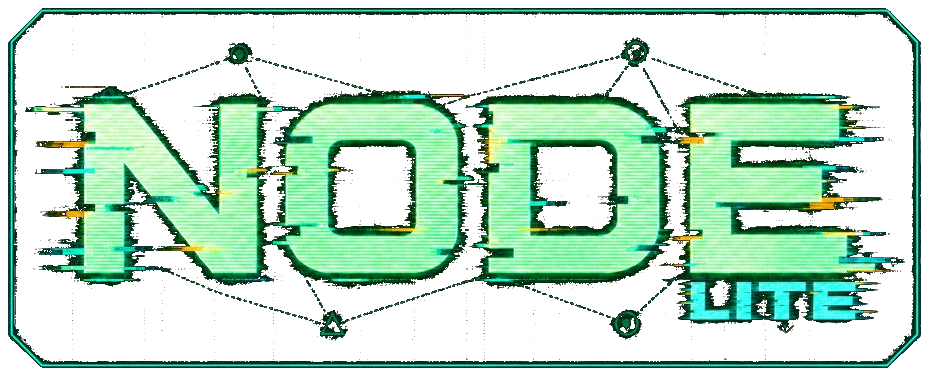

  

  <h1>NODE.LITE — Settlement Network Dashboard</h1>

  

    <strong>Your settlement network, ready when you need it.</strong> 
    A lightweight in-game dashboard for vanilla Fallout 4 settlements.
  

  

    
    
  

  

    <a href="#overview">Overview</a> ·
    <a href="#nodelite-or-original-node">NODE.LITE or NODE</a> ·
    <a href="#features">Features</a> ·
    <a href="#requirements">Requirements</a> ·
    <a href="#installation">Installation</a> ·
    <a href="#support-and-troubleshooting">Support</a>
  

---

## Overview

NODE.LITE is the lighter NODE dashboard for vanilla Fallout 4 settlements. Open it from anywhere to compare workshops, review local needs, inspect residents, and use supported settler controls — without travelling from settlement to settlement.

Settlement information stays ready while you play, so you can open the dashboard and see your settlements right away.

> [!NOTE]
> NODE.LITE is a first release. Features will continue to grow, and community reports are an important part of improving compatibility and stability.

## NODE.LITE or original NODE?

| | **NODE.LITE** | **NODE** |
| --- | --- | --- |
| Best for | Vanilla settlements and lighter play | Sim Settlements 2 cities and the extra city detail NODE is built around |
| What you see | Workshop totals, residents, homes, jobs, and caravan reach | That picture plus SS2 city plans, leaders, plots, services, and related city systems |
| Extra settlement mods | Not required | Sim Settlements 2 and Workshop Framework |

If you use Sim Settlements 2 and want the full city picture, use original NODE:

- [NODE on Nexus Mods](https://www.nexusmods.com/fallout4/mods/107925)
- [NODE on GitHub](https://github.com/NOBOBYoO/NODE)

Do not run NODE and NODE.LITE together. Pick the dashboard that matches how you play.

## Features

### Network overview

- View every owned settlement in one place.
- Compare population, happiness, food, water, power, defense, and build budget.
- Quickly identify communities that need attention.

### Settlement overview

- Review workshop totals for the selected settlement, including population, resources, defense, beds, build budget, and caravan reach.
- Browse residents, including SPECIAL, type, home, and job.
- Filter for residents with no home, unemployed residents, and provisioners.
- Use supported controls for Commandable, Allow Move, Allow Caravan, Move to Player, and settlement transfer.

### Settings and quality of life

- Press **Home** to open NODE.LITE and **Esc** to close it.
- Rebind the open key from the in-game Settings page.
- Choose the NODE.LITE theme or an alternate color theme.
- Turn the Settlement Updates bar on or off in Settings.
- Reduce interface animation in Settings.
- Review useful status and troubleshooting information from the built-in Console page.

## Requirements

Install the dependency intended for your Fallout 4 runtime. Use the Old-Gen, Next-Gen, or Anniversary-compatible file offered by each dependency author where applicable.

### Fallout 4

Supported runtimes: **1.10.163** (Old-Gen), **1.10.984** (Next-Gen), and **1.11.191 or newer** (Anniversary Edition).

### Fallout 4 Script Extender

Install the F4SE build made for your exact Fallout 4 runtime and always launch the game through F4SE.

### Address Library for F4SE Plugins

Choose the Address Library package that matches your Old-Gen, Next-Gen, or Anniversary runtime.

### PrismaUI F4

NODE.LITE requires **PrismaUI F4 2.1**. Older Prisma UI builds are not supported.

> [!IMPORTANT]
> **NODE.LITE requires PrismaUI F4 2.1.** Older Prisma UI builds will not open the dashboard.
>
> **`NODE.LITE.esp` is required and must be enabled.** Settler controls need it. Sim Settlements 2 and Workshop Framework are **not** required.

## Installation

### Mod Organizer 2 or Vortex — recommended

1. Install the required dependencies listed above for your game version.
2. Download NODE.LITE from the [GitHub Releases page](https://github.com/NOBOBYoO/NODE-LITE/releases).
3. Install the archive with Mod Organizer 2 or Vortex.
4. Confirm that **`NODE.LITE.esp`** is enabled in your load order.
5. Launch Fallout 4 through **F4SE**.
6. Load your game and press **Home** to open NODE.LITE.

### Manual installation

1. Install all requirements first.
2. Open the NODE.LITE archive and copy its **`Data`** folder into the Fallout 4 installation folder.
3. Allow the files to merge into the game's existing **`Data`** folder. Do not create a second `Data\Data` folder.
4. Enable **`NODE.LITE.esp`** with your preferred plugin manager.
5. Launch Fallout 4 through F4SE and press **Home** in-game.

### Updating NODE.LITE

Install the new version over the existing NODE.LITE installation and allow your mod manager to replace the older packaged files.

Your NODE.LITE settings are saved on first launch and stay in place when you update.

## Using NODE.LITE

1. Press **Home** while in-game to open the dashboard.
2. Use **Network Overview** to compare all owned settlements.
3. Use **Settlement Overview** to inspect one settlement and its residents.
4. Use **Settings** to change the open key, theme, motion, and Settlement Updates display.
5. Press **Esc** to close NODE.LITE.

NODE.LITE starts filling in settlement information after you load a save. Large saves can take longer at first.

## Support and troubleshooting

- **NODE.LITE does not open:** Confirm that Fallout 4 was launched through F4SE and that PrismaUI F4 **2.1** is installed. Older Prisma UI builds are not supported.
- **Interface feels busy:** Enable **Reduce Animations** in Settings.
- **Log location:** `Documents\My Games\Fallout4\F4SE\NODE.LITE.log`.

When reporting a problem, please include:

- Your exact Fallout 4 version.
- Your NODE.LITE version.
- `NODE.LITE.log`, `f4se.log`, and `PrismaUI_F4.log`.
- The affected settlement and clear reproduction steps, when applicable.

## AI usage disclosure

AI tools are used during NODE.LITE's development for automation, debugging, image generation, and implementation support. Design decisions, feature direction, review, testing, and release responsibility remain under the author's supervision.

## Credits

- **PrismaUI F4** — [StarkMP; Fallout 4 port by NomadsReach / Fallen World](https://www.nexusmods.com/fallout4/mods/105454)
- **Fallout 4 Script Extender (F4SE)** — [Ian Patterson, Stephen Abel, and Brendan Borthwick](https://f4se.silverlock.org/)
- **Address Library for F4SE Plugins** — [meh321](https://www.nexusmods.com/fallout4/mods/47327)

## Repository notice

This public repository contains NODE.LITE release information and approved downloadable packages. NODE.LITE's source code is maintained privately and is not distributed from this repository.

See [LICENSE](LICENSE) for the terms that apply to NODE.LITE's public release files.

---

  <strong>NODE.LITE</strong> 
  Your settlement network, ready when you need it.  
  <a href="https://github.com/NOBOBYoO/NODE-LITE/releases">Releases</a> ·
  <a href="https://www.nexusmods.com/fallout4/mods/107925">Original NODE on Nexus</a> ·
  <a href="https://github.com/NOBOBYoO/NODE">Original NODE on GitHub</a>

